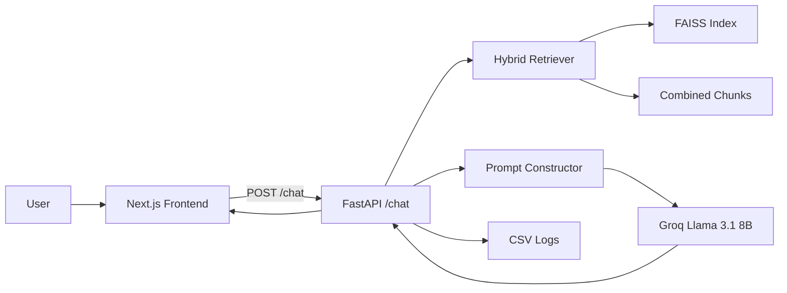

# CS4241 - Introduction to Artificial Intelligence (2026)

## AcaIntel AI: Custom RAG Chat Assistant for Academic City

This repository contains my project-based exam solution for **CS4241 - Introduction to Artificial Intelligence** (Academic City University, End of Second Semester Examination - 2026).

The solution implements a **manual Retrieval-Augmented Generation (RAG)** system for querying:
- Ghana 2025 Budget Statement
- Ghana election results dataset

No end-to-end RAG frameworks (LangChain/LlamaIndex/pre-built pipelines) are used. Core components are implemented directly in code: ingestion, chunking, embeddings, retrieval, prompt construction, and response generation.

---

## 1) Exam Mapping (What this project covers)

Based on the exam brief in `Introduction to  Artificial  Intelligence QP.pdf`, this project addresses:

- **Part A (Data Engineering & Preparation)**  
  Data cleaning and chunking pipelines for election CSV and budget PDF.

- **Part B (Custom Retrieval System)**  
  Sentence-transformer embeddings + FAISS vector store + top-k retrieval + custom hybrid scoring (keyword + source + phrase boosts).

- **Part C (Prompt Engineering & Generation)**  
  Custom RAG prompt template, hallucination controls, and context truncation strategy.

- **Part D (Full RAG Pipeline)**  
  End-to-end query flow: retrieval -> context selection -> prompt -> LLM -> response, with logging and UI visibility of retrieval details.

- **Part E (Critical Evaluation & Adversarial Testing)**  
  Framework in place for adversarial queries and comparison; add your experiment logs under a dedicated section or files.

- **Part F (Architecture & System Design)**  
  Architectural flow documented below.

- **Part G (Innovation Component)**  
  Domain-specific scoring in retrieval (hybrid weighted formula + source/phrase boosts).

---

## 2) Project Overview

**AcaIntel AI** is a domain-focused assistant that answers questions using retrieved evidence from indexed sources before generation.

The system is split into two apps:

- `backend/` (FastAPI + custom RAG engine)
- `frontend/` (Next.js + ChatGPT-like interface)

Key design objective: improve factual reliability by grounding answers in retrieved evidence and exposing retrieval/prompt internals to users.

---

## 3) Tech Stack

### Frontend
- Next.js 16 (App Router)
- React 19
- Tailwind CSS v4
- shadcn/ui + custom UI components
- react-markdown

### Backend
- FastAPI
- FAISS (`IndexFlatIP`)
- sentence-transformers (`all-MiniLM-L6-v2`)
- Groq API (`llama-3.1-8b-instant`)
- pandas / numpy
- PyMuPDF (for PDF extraction)

---

## 4) Repository Structure

```text
Exams/
├─ README.md
├─ Introduction to  Artificial  Intelligence QP.pdf
├─ frontend/
│  ├─ .env
│  ├─ package.json
│  └─ src/
│     ├─ app/
│     │  ├─ layout.tsx
│     │  ├─ page.tsx
│     │  ├─ chat/page.tsx
│     │  └─ how-it-works/page.tsx
│     ├─ components/
│     │  ├─ Navbar.tsx
│     │  ├─ Footer.tsx
│     │  └─ ui/
│     └─ lib/
│        ├─ api.ts
│        └─ utils.ts
└─ backend/
   ├─ .env
   ├─ main.py
   ├─ data/
   │  └─ Ghana_Election_Result.csv
   ├─ processed/
   ├─ vector_store/
   ├─ logs/
   └─ src/acaintel/
      ├─ config.py
      ├─ api/routes/chat.py
      ├─ retrieval/hybrid_retriver.py
      ├─ generation/{prompt_engineering.py,generator.py}
      ├─ services/rag.py
      └─ pipelines/
```

---

## 5) System Architecture



---

## 6) RAG Pipeline Details

### Step 1: Ingestion and chunking

- **Election pipeline** cleans CSV and creates text chunks with metadata.
- **Budget pipeline** extracts text page-by-page from the budget PDF and chunks it for retrieval.

### Step 2: Embeddings and vector indexing

- Embedding model: `all-MiniLM-L6-v2`
- Chunks from both datasets are merged.
- Embeddings are generated and saved.
- FAISS index is built with normalized vectors for similarity retrieval.

### Step 3: Hybrid retrieval

Retrieval combines:
- vector similarity
- keyword overlap score
- source-aware boost
- exact phrase boost

Formula used:

```text
final_score = 0.70 * vector_score
            + 0.20 * keyword_score
            + source_boost
            + phrase_boost
```

### Step 4: Prompt engineering

Prompt is built by:
- formatting retrieved contexts with source + metadata
- enforcing grounded answer rules
- handling missing-evidence cases explicitly

### Step 5: Generation

The backend sends the final prompt to Groq:
- model: `llama-3.1-8b-instant`
- temperature: `0.2`
- max tokens: `700`

### Step 6: Logging

Each query can log:
- user query
- retrieved contexts
- prompt
- final answer

to `backend/logs/rag_logs.csv`.

---

## 7) API Endpoints

### `GET /`
Health message:

```json
{ "message": "AcaIntel AI backend is running" }
```

### `POST /chat`
Request:

```json
{ "query": "What is the theme of the 2025 budget?" }
```

Response:

```json
{
  "query": "...",
  "answer": "...",
  "retrieved_chunks": [],
  "final_prompt": "..."
}
```

---

## 8) Frontend Features

### Home Interface (`/`)
- Hero section and contextual starter prompts
- Quick prompt cards (budget/election examples)
- Input bar that routes to chat with query preloaded

### Chat Interface (`/chat`)
- ChatGPT-like interaction layout
- User and AI response cards
- Markdown answer rendering
- Verified sources chips
- Expanders for:
  - retrieved context
  - technical details (final prompt)

### How-it-works (`/how-it-works`)
- Pipeline explanation for users and evaluators

---

## 9) Setup Instructions

## 9.1 Prerequisites

- Node.js (recommended modern LTS)
- Python 3.10+
- pip and virtual environment support

## 9.2 Backend setup

```bash
cd backend
python -m venv .venv
```

Activate environment:

- **Windows PowerShell**
```bash
.\.venv\Scripts\Activate.ps1
```

- **macOS/Linux**
```bash
source .venv/bin/activate
```

Install dependencies:

```bash
pip install fastapi uvicorn pydantic faiss-cpu sentence-transformers groq python-dotenv pandas numpy pymupdf
```

## 9.3 Frontend setup

```bash
cd ../frontend
npm install
```

---

## 10) Environment Variables

### `backend/.env`

```env
GROQ_API_KEY=your_groq_api_key_here
```

### `frontend/.env`

```env
NEXT_PUBLIC_BACKEND_URL=http://localhost:8000
```

---

## 11) Run Locally

### Start backend

```bash
cd backend
uvicorn main:app --reload --port 8000
```

### Start frontend

```bash
cd frontend
npm run dev
```

Open:
- Frontend: `http://localhost:3000`
- Backend docs: `http://localhost:8000/docs`

---

## 12) Data Preparation and Index Build

Run these from `backend/` after activating virtualenv:

1. Build election chunks:

```bash
python -m src.acaintel.pipelines.election_data_pipeline
```

2. Build budget chunks (ensure `backend/data/Budget.pdf` exists):

```bash
python -m src.acaintel.pipelines.budget_pdf_pipeline
```

3. Build vector index:

```bash
python -m src.acaintel.pipelines.build_vector_index
```

Expected generated assets:
- `backend/processed/ghana_election_chunks.json`
- `backend/processed/budget_chunks.json`
- `backend/vector_store/combined_chunks.json`
- `backend/vector_store/faiss_index.index`
- `backend/vector_store/embeddings.pkl`

---

## 13) Evaluation and Experiment Log Template

To satisfy the exam requirements for analysis and evidence, include manual logs for:

### A) Chunking experiments
- chunk size / overlap settings tested
- retrieval quality observations

### B) Prompt experiments
- same query under prompt variants
- differences in factuality and specificity

### C) Failure cases and fixes
- query that returned irrelevant chunks
- fix implemented (e.g., source boost or phrase boost)
- before/after comparison

### D) Adversarial queries (at least two)
- ambiguous query case
- misleading/incomplete query case
- accuracy/hallucination consistency notes

### E) RAG vs pure LLM comparison
- same queries under both settings
- evidence-based comparison table

---

## 14) Deployment Checklist (Exam Submission)

- [ ] Push source code to GitHub repository
- [ ] Deploy application (frontend and backend)
- [ ] Add detailed documentation (this README + logs)
- [ ] Record and include <=2 minute walkthrough video
- [ ] Share repository and deployed URL via course email
- [ ] Invite required evaluator account as collaborator

---

## 15) Current Limitations and Future Improvements

- Add `requirements.txt`/`pyproject.toml` for reproducible backend installs
- Restrict CORS for production
- Add answer streaming on frontend
- Add retriever evaluation metrics and automated benchmark suite
- Add conversation persistence and feedback loop
- Add citation click-through to exact source passages

---

## 16) Academic Integrity Note

This project is prepared for academic evaluation. Any reuse should properly acknowledge source data, models, and contributors.

